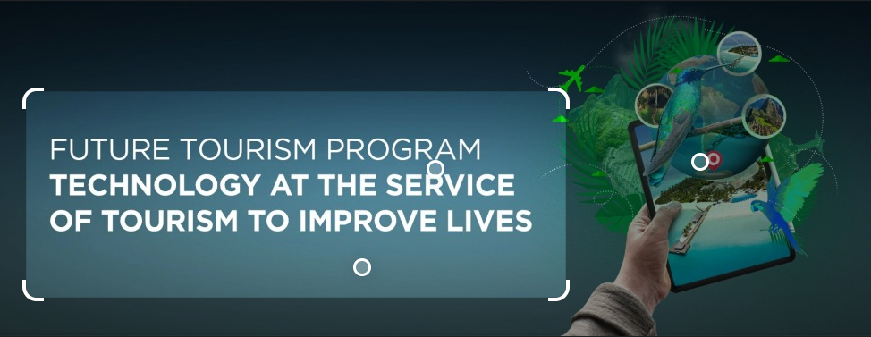
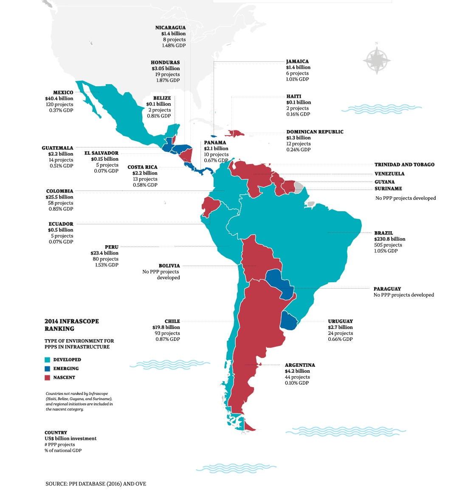
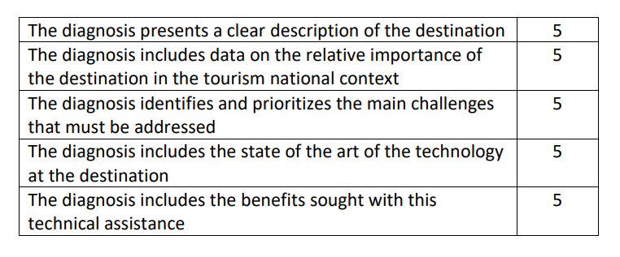
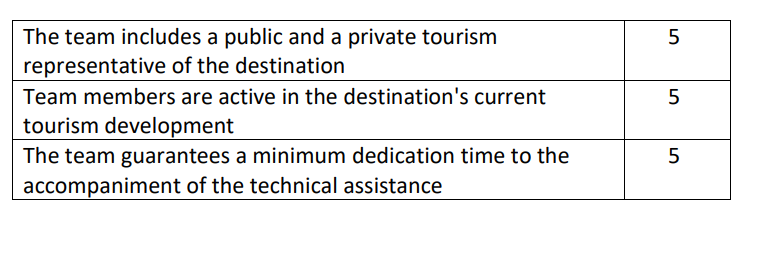
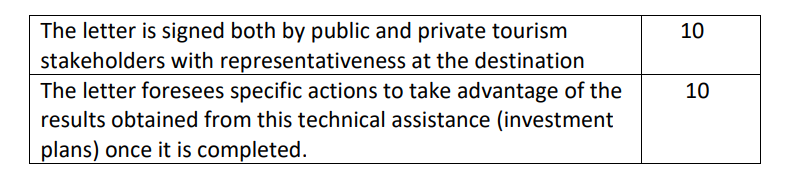

```{r setup, echo=FALSE}
options(htmltools.dir.version = FALSE)
knitr::opts_chunk$set(
  fig.width=8, fig.height=3.5, fig.retina=3,
  out.width = "100%",
  cache = FALSE,
  echo = TRUE,
  message = FALSE, 
  warning = FALSE,
  hiline = TRUE
)
```

```{r xaringan-themer, include=FALSE, warning=FALSE}
library(xaringanthemer)
style_duo_accent(
  primary_color = "#1381B0",
  secondary_color = "#FF961C",
  inverse_header_color = "#FFFFFF"
)
```


```{r, include=FALSE}
library(countdown) 
```

```{r, include=FALSE}
at <-"Andrea Tuitt"  
```
```{r, include=FALSE}
amr <-"Andy Roberts"
```

```{r, include=FALSE}
bb <-"Bertrand Bhikarry"
```
```{r, include=FALSE}
hcc <-"Haynes Cowie-Clarke"
```

```{r, include=FALSE}
gl <-"Jeffrey Lewis"
```

```{r, include=FALSE}
sas <-"Shannon Ali-Samhoul"
```

```{r, include=FALSE}
ra <-"Ryan Allard" 
```

```{r, include=FALSE}
sm <-"Sean McCoon"
```
```{r, include=FALSE}
et <-"Environment Tobago"
```
```{r, include=FALSE}
ngo <-"Non-profit organisation"
```
```{r, include=FALSE}
ngos <-"Non-profit organisations"
```

```{r, include=FALSE}
canari <-"Caribbean Natural Resources Institute"
```

```{r, include=FALSE}
thata <-"Tobago Hotel and Tourism Association"
```


```{r xaringan-logo, echo=FALSE}
xaringanExtra::use_logo(
  image_url = "https://drive.google.com/uc?export=view&id=11GveNpJ7VdDl4t1pUGszDuM10P-KCMaB"
)
```


```{r, echo=FALSE}
xaringanExtra::use_webcam(width = 300, height = 225)
```
```{r xaringan-panelset, echo=FALSE}
xaringanExtra::use_panelset()
```

```{r xaringanExtra, echo=FALSE}
xaringanExtra::use_xaringan_extra(c("tile_view", "animate_css", "tachyons"))
```
## Pushing techy tourism

Tourism is the sector most affected by COVID. **Recovery** will accelerate tourism. To sustain that growth however will require tech. It's time to gauge our technological readiness and move on from there.  

>Sharing **IDB**'s  [call to accelerate technology](https://convocatorias.iadb.org/en/integracion-turistica/future-tourism-program-diagnoses-level-technological-readiness-tourism) in the tourism destinations of Latin America and the Caribbean



---
layout: true

## Framing

>"Towards the resolution of resilience, competitiveness, and socio-environmental sustainability challenges in LAC tourist destinations. As well as to stimulate coordination of the regional tourism ecosystem".

In other words. **A rising tide lifts all ships**

---
layout: false

## The IDB footprint

<center></center>

---

## Need to know

.left-column[ 

Future Tourism Program ID

Submission due-date

Country

Sector

Value (*Total*)

Counterpart financing

Post registration briefing (*webinar*)
]


.right-column[

RG-T3660

March 30th, 2022


Regional  

Sustainable tourism  

US$1.5M

$0

[my Link to briefing](https://www.google.com/url?q=https://iadb-org.zoom.us/w/92586696123?tk%3DwRDKF3AmrlWlNGVhVWiFyXj1RoSgeU1nWPomUfU-dYI.DQMAAAAVjpjduxY0RFQxVHlnOFIwYUItQ3dzSG0xaktBAAAAAAAAAAAAAAAAAAAAAAAAAAAAAA%26uuid%3DWN_vjtcQvGCSKid4qCQkyCdtQ&sa=D&source=calendar&ust=1644518439020737&usg=AOvVaw0SiBcXCN-QAvnSVBkn1mxs)
]
<!--- briefing link best obtained by registering--->
.footnote[This Technical Cooperation (TC) aims to generate **methodological and operational** instruments that contribute to the digitization of the LAC tourism sector to reactivate tourism activity under the new context posed by the COVID19 pandemic, as well as to respond to sectoral challenges of structure.]
---

## Of importance

What do the beneficiary destinations get?

Each destination selected will obtain:

- A **personalized diagnosis of its level of technological readiness**, based on its main challenges (*prioritized by the destinations themselves*); 

- **A detailed action and pre-investment plan** (*agreed between the public and private sector*) to accelerate technological assimilation at the destination. 

.footnote[Ten (10) destinations will be selected from; Trinidad and Tobago, Argentina, Barbados, Bahamas, Belize, Brazil, Bolivia, Nicaragua, Mexico, Jamaica, Honduras, Haiti, Guyana, Guatemala, El Salvador, Ecuador, Costa Rica, Columbia and Chile.]

---
## Selection criteria

Applicant (beneficiary destinations) must have;

1. A tourism org (*like Tourism Div, TTAL, THATA*)

1. Duly signed letters of interest from key stakeholder groups

1. A dedicated team with active private-public sector involvement.

1. a diagnosis of the destination (*ESG considerations*)

1. a tourism plan *in force*

---

## Selection process

Applications will be evaluated and scored (*closest to 60 pts*)

.panelset.sideways[
.panel[.panel-name[Scope of the diagnosis. 25 points]

]
.panel[.panel-name[Team strength. 15 points]

  
]

.panel[.panel-name[Public-Private letter of interest. 20 pts]

]
]


---


## A quick check before applying

Does this project fits Tobago's


1. <input type="checkbox" checked> developmental outlook</input>

1. <input type= "checkbox" checked> benefits investors</input>,

1. <input type= "checkbox" checked> local stakeholders</input> and 

1. <input type= "checkbox" checked> visitors</input>

---
class: center, middle

## Up for discussion

<dl>
<dt>An application has to be made by March 30</dt>
  <dd><strong>Who</strong>?</dd>
  
</dl>
---
class: center, middle

.can-edit[

# END 

>**But clearly, this is ours to do...!**

]

---
